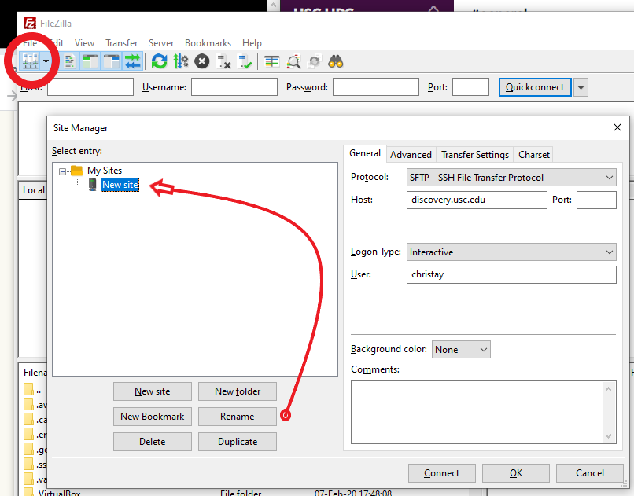
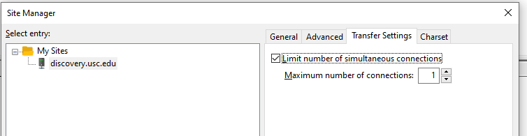
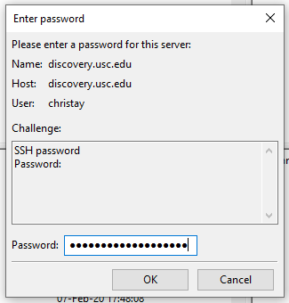
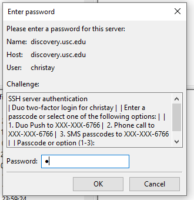
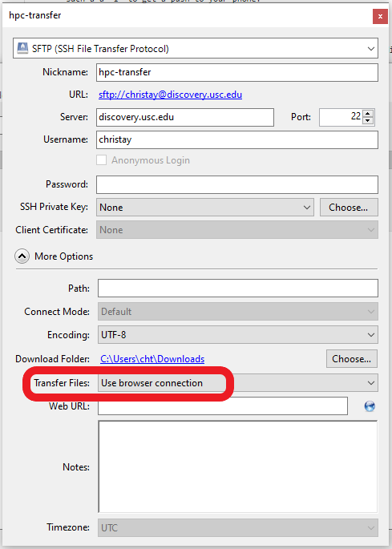
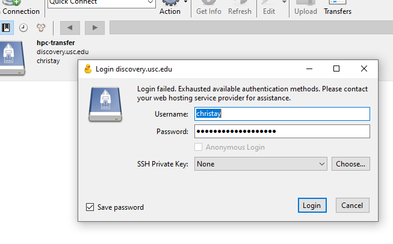
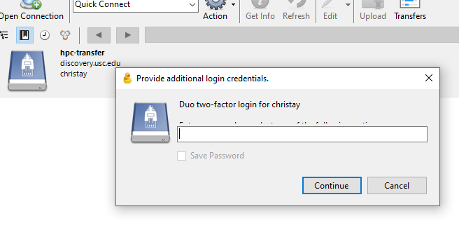
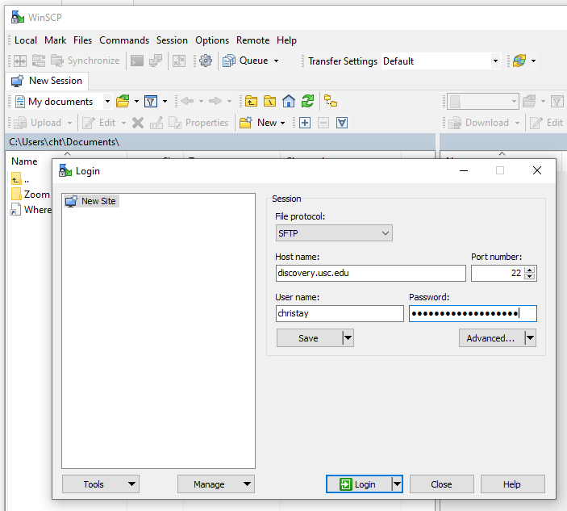
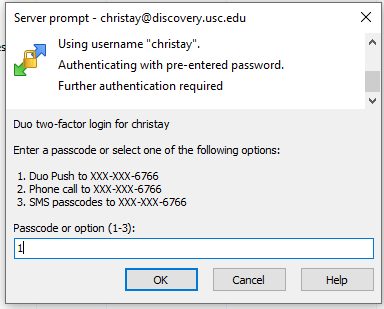

# Transferring Files between Your Computer and HPC

For many HPC users, the most convenient way to transfer files between their computer and HPC is to use a GUI (graphical user interface)-based SFTP client. The SFTP client is installed and run on your computer. It works by connecting to the SFTP server running on discovery.usc.edu, enabling you to transfer files back and forth.

Along with USC login credentials, Duo two-factor authentication (2FA) is required for HPC access. Most third-party SSH clients can be configured to use 2FA, and to maintain an open connection so as to minimize the number of authentication requests during a transfer session. Refer to the documentation for how to do this for your preferred client.

You are welcome to use any SFTP client you wish. FileZilla, WinSCP and Cyberduck are popular choices.

## FileZilla
You can download FileZilla from the vendor website at https://filezilla-project.org.

Make sure to download FileZilla client. Once the installation is complete you will need to create an HPC profile. You can do so by going to the Site-Manager and clicking on "New site":

For convenience you can click the Rename button to name the site something memorable. Apply these settings:
* Protocol: SFTP – SSH File Transfer Protocol
* Host: discovery.usc.edu
* Logon Type: Interactive
* User: Your USC NetID/HPC username

After the General tab settings have been filled out, select the Transfer Settings tab:
* Check "Limit number of simultaneous connections"
* Maximum number of connections: 1
These settings will keep a single connection open so you will not have to re-authenticate.

Click Connect and the password prompt will pop up. Enter your network ID password:

Next it asks for a password again, but what it really wants is the Duo push method. Choose the number corresponding to your preference, such a a "1" to get a push to your phone:

When the authentication goes through you are logged into your home directory on discovery, with your local laptop or PC folders on the left, and your Linux home directory structure on the right.

On first connecting, click to accept the server key if a pop up appears.

---

## Cyberduck

You can download Cyberduck from the vendor website at https://cyberduck.io/.

Go to the Bookmark menu and choose New Bookmark and save these settings:

Server: discovery.usc.edu
Username: Your USC NetID/HPC username
(Optional) SSH Private Key: The path to your private key (usually ~/.ssh/id_rsa)

To configure Duo compatibility expand More Options and set Transfer Files to Use browser connection.

Clicking the red X in the upper right saves your settings. Highlighting the bookmark and pressing Enter on your keyboard will open the connection. Click Allow to accept the unknown fingerprint (this is fine), and you will get the login popup.

It won't log you in right away- you need one more step.

The last screen is where you enter a numeral "1" to have the Duo push go to your phone. Once that succeeds you are logged into your Linux home directory on discovery.

---

#WinSCP

WinSCP is available at https://winscp.net. After installing, click on New Session and enter your relevant details. Click Login to continue.

Next you will be asked to select your Duo authentication method. Enter the number of your choice.

After you are logged in you have a drag and drop layout with your local system on one side and your Linux directory structure on the other. The tool offers extensive additional functionality for multiple transfers, file synchonizing, and more. Experiment to find your most productive workflow.

